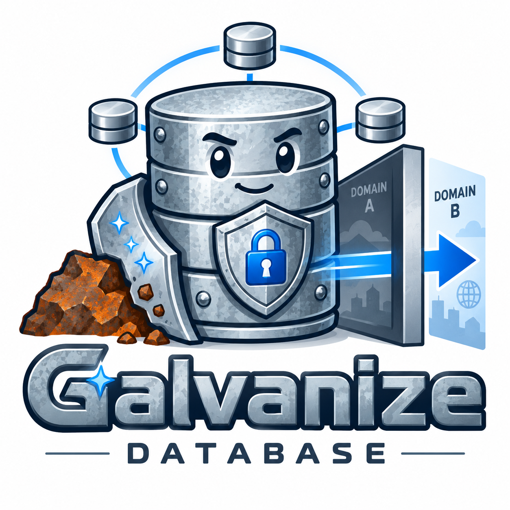

<p align="center">
  
</p>

# GALVANIZE

GALVANIZE is a security-focused fork of [Corrosion](https://github.com/superfly/corrosion): a gossip-based, distributed SQLite database for large systems. It retains Corrosion's eventually consistent, local-first data model while adding encryption at rest, controlled peer replication, and one-way cross-domain replication.

## Why GALVANIZE

GALVANIZE is for deployments that need distributed state without giving up control of data at rest or replication paths. Each node has a local SQLite database, changes are synchronized through an eventually consistent mesh, and applications read from their local node.

### Encryption at rest

Local SQLite databases can be encrypted with SQLite3 Multiple Ciphers (SQLite3MC). To ensure zero plaintext secrets on the filesystem or environment, database keys are supplied dynamically via HTTP POST JSON to the Remote Unlock API (`POST /v1/admin/unlock`). In addition, the `galvanize rekey` CLI command supports safely rotating an existing database key while the agent is stopped.

### Cross-domain, unidirectional replication

The optional High/Low replication feature carries changes in one direction from a Low domain to a High domain. It supports staged directory/USB-style transfer and network transports, with encrypted, signed artifacts. The receiving High domain verifies and decrypts artifacts before applying them; it does not replicate changes back to Low.

### Allow-list replication control

Gossip peer communication can be limited to an explicit allow-list of IP addresses and CIDR ranges. The allow-list is enforced for inbound and outbound cluster traffic, including membership gossip, synchronization, replication broadcasts, and discovery bootstrap.

## How it works

In a nutshell, GALVANIZE:

- Maintains a SQLite database on each node
- Gossips local changes throughout the cluster
- Uses [CR-SQLite](https://github.com/vlcn-io/cr-sqlite) for conflict resolution with CRDTs
- Uses [Foca](https://github.com/caio/foca) to manage cluster membership using a SWIM protocol
- Periodically synchronizes with a subset of other cluster nodes to ensure consistency
- Encrypts each local database at rest when a database key is configured
- Can restrict cluster peer traffic with `[gossip.allow-list]`
- Can export Low-domain changes as signed, encrypted bundles for one-way High-domain ingestion

## Features

- A flexible API to read from and write to GALVANIZE's store using SQL statements
- File-based schemas with on-the-fly updates
- HTTP streaming subscriptions based on SQL queries
- Live population of configuration files from GALVANIZE state with user-defined [Rhai](https://rhai.rs/) templates
- Storage and propagation of state from locally registered Consul services, replacing the central database with GALVANIZE's distributed state
- Secure peer-to-peer communication with the [QUIC](https://datatracker.ietf.org/doc/html/rfc9000) transport protocol (using [Quinn](https://github.com/quinn-rs/quinn))
- SQLite3MC-backed encryption at rest and offline database-key rotation
- IP/CIDR allow-list enforcement for cluster peer communication
- Signed and encrypted, one-way Low-to-High cross-domain replication

## Usage overview

Run the GALVANIZE agent on every node or host in the cluster. Applications can access the local GALVANIZE database through its HTTP endpoint or its PostgreSQL wire-protocol endpoint. The PostgreSQL endpoint provides protocol compatibility only: queries must use SQLite SQL syntax. The HTTP API also supports querying and updating the database and subscribing to change notifications.

The `galvanize` CLI provides administration and database access. The Cargo package and several internal crate names still use `corrosion` or `corro-*` to make upstream changes easier to integrate, but the executable built by this fork is `galvanize`.

### Quick start

- Prepare the agent configuration and initial database schema.
- Start the node. If configured with `await_unlock = true` or using an existing encrypted database, unlock the node by sending `POST /v1/admin/unlock` with JSON `{"key": "your_passphrase", "cipher": "chacha20"}`.
- Optionally set `[gossip.allow-list]` to allowed peer IP addresses and CIDRs; its default is `["*"]`.
- Configure `[highlow]` with exactly one role (`low`, `high`, or `high-replica`) to enable cross-domain transfer.

The upstream [Corrosion documentation](https://superfly.github.io/corrosion/) remains useful for the base API, schema, and agent configuration. GALVANIZE-specific changes and operational details are tracked in [FORK_CHANGES.md](FORK_CHANGES.md).

## Building GALVANIZE

From within the repository directory:

```
cargo build --release -p corrosion --bin galvanize
./target/release/galvanize --help
```
