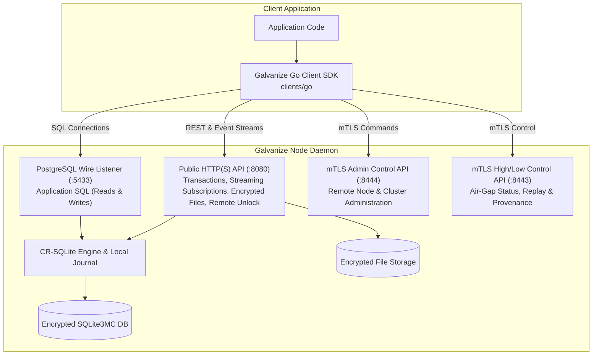

# GALVANIZE Usage and Client Integration Guide

GALVANIZE is a decentralized, encrypted-at-rest distributed database built on SQLite3MC and CR-SQLite with cross-domain (High/Low) air-gap replication.

## Architecture and Access Model

Applications interact with GALVANIZE through the official Go client SDK located in [`clients/go`](file:///home/marc/GALVANIZE/clients/go).



### Core Access Principles

- **Always Use the Official Client SDK:** Applications should interact with GALVANIZE via [`clients/go`](file:///home/marc/GALVANIZE/clients/go). Direct `curl` commands or manual `psql` invocations are intended for low-level operator debugging and deployment validation.
- **Never Access SQLite Files Directly:** Application code must never open a running node's SQLite database file directly on disk. Bypassing the PostgreSQL wire listener or HTTP API bypasses CR-SQLite mutation tracking, change journals, and local encryption boundaries.
- **Zero Plaintext Secrets:** Passwords, database encryption keys (`GALVANIZE_DB_KEY`), and mTLS credentials must always be provided via named environment variables or protected certificate files—never hardcoded in configuration files, CLI arguments, or application source code.

---

## 1. Node Setup and Managed Schemas

### Example `config.toml`

Each GALVANIZE node runs as the `galvanize` binary (`cargo build --release -p corrosion --bin galvanize`). The configuration specifies database encryption settings, client listeners, and optional mTLS control APIs:

```toml
[db]
path = "./data/corrosion.db"
schema_paths = ["./schema"]
await_unlock = true

[api]
addr = "127.0.0.1:8080"

[[api.pg]]
addr = "127.0.0.1:5433"
readonly = false

[files]
enabled = true
accept-uploads = true
accept-from-peers = true
storage-path = "./data/files"

[admin]
uds_path = "./data/admin.sock"

[admin.control-api]
addr = "127.0.0.1:8444"
server-cert-env = "GALV_ADMIN_SERVER_CERT"
server-key-env = "GALV_ADMIN_SERVER_KEY"
client-ca-cert-env = "GALV_ADMIN_CLIENT_CA"

[gossip]
addr = "127.0.0.1:8787"
bootstrap = []
plaintext = true
```

Start the node:
```bash
./target/release/galvanize --config ./config.toml agent
```

### Managed Schema Rules

Place application DDL in SQL files under the directory specified by `schema_paths` (e.g., `schema/app.sql`):

```sql
CREATE TABLE IF NOT EXISTS notes (
    id INTEGER PRIMARY KEY NOT NULL,
    title TEXT NOT NULL DEFAULT '',
    body TEXT NOT NULL DEFAULT '',
    created_at INTEGER NOT NULL DEFAULT 0
) WITHOUT ROWID;

CREATE INDEX IF NOT EXISTS notes_title_idx ON notes (title);

CREATE VIEW IF NOT EXISTS recent_notes AS
SELECT id, title, body FROM notes WHERE created_at > 0;
```

#### Replicated Schema Rules:
1. **Primary Keys:** Every replicated table **must** declare a primary key, and **each primary-key column must be marked `NOT NULL`**.
2. **Column Defaults:** All non-primary-key columns marked `NOT NULL` **must** specify a `DEFAULT` value to ensure forward and backward schema compatibility during schema evolution across nodes.
3. **No Foreign Keys or Unique Constraints:** Unique indexes and column `REFERENCES` foreign keys are rejected by the CRDT schema validator. Uniqueness is governed by primary keys.
4. **Managed Views & Indexes:** Standard non-unique `CREATE INDEX` and `CREATE VIEW` statements are supported. Views are local SQL evaluation objects over replicated tables.
5. **Air-Gap Schema Boundary:** Galvanize does not replicate DDL statements across High/Low air-gaps. Maintain matching schema files on both High and Low clusters; High receivers hold bundles with mismatched schema hashes in `waiting-schema` until the schema is aligned.

---

## 2. Go Client SDK Installation and Setup

The Go SDK is located in [`clients/go`](file:///home/marc/GALVANIZE/clients/go).

```bash
# In your go.mod
require github.com/marcgauthier/galvanize/clients/go v0.0.0
```

```go
import (
    galvanize "github.com/marcgauthier/galvanize/clients/go"
)
```

### Initializing the Client

```go
client, err := galvanize.NewClient(galvanize.Config{
    APIURL:      "https://127.0.0.1:8080",
    AdminURL:    "https://127.0.0.1:8444",
    HighLowURL:  "https://127.0.0.1:8443",
    BearerToken: os.Getenv("GALVANIZE_API_TOKEN"),
    TLSConfig:   tlsConfig, // Custom CA roots and client certs for mTLS
})
if err != nil {
    log.Fatalf("Failed to initialize client: %v", err)
}
```

---

## 3. Remote Node Unlock via SDK

When a node starts with `await_unlock = true` (or an encrypted database), background replication, gossip, and PostgreSQL listeners remain dormant until the database is unlocked. The database encryption key must be supplied via a secure HTTPS API call reading directly from a named environment variable:

```go
package main

import (
    "context"
    "log"
    galvanize "github.com/marcgauthier/galvanize/clients/go"
)

func main() {
    client, err := galvanize.NewClient(galvanize.Config{
        APIURL: "https://127.0.0.1:8080",
    })
    if err != nil {
        log.Fatal(err)
    }

    // Reads the key securely from GALVANIZE_DB_KEY; enforces HTTPS connection
    status, err := client.UnlockFromEnvTyped(context.Background(), "GALVANIZE_DB_KEY", nil, nil)
    if err != nil {
        log.Fatalf("Unlock failed: %v", err)
    }
    log.Printf("Node unlocked successfully: %s", status.Status)
}
```

---

## 4. SQL Operations (PostgreSQL Wire Protocol)

The PostgreSQL wire listener (`[[api.pg]]`) is the primary interface for relational SQL reads and writes against running nodes. The Go SDK provides [`OpenSQLFromEnv`](file:///home/marc/GALVANIZE/clients/go/sql.go) to open a standard `database/sql` connection pool backed by `github.com/lib/pq`.

> [!NOTE]
> SQL queries use **SQLite dialect**. The PostgreSQL wire protocol serves as the network transport, transparently driving CR-SQLite conflict-free replication and change capture.

Set your connection string in an environment variable (e.g., `GALVANIZE_PG_DSN="postgresql://postgres@127.0.0.1:5433/postgres?sslmode=disable"`).

```go
package main

import (
    "context"
    "database/sql"
    "fmt"
    "log"
    galvanize "github.com/marcgauthier/galvanize/clients/go"
)

func main() {
    ctx := context.Background()

    // Open connection pool from GALVANIZE_PG_DSN
    db, err := galvanize.OpenSQLFromEnv("GALVANIZE_PG_DSN")
    if err != nil {
        log.Fatal(err)
    }
    defer db.Close()

    // Insert data (parameterized query with $1, $2 placeholders)
    _, err = db.ExecContext(ctx, "INSERT INTO notes (id, title, body, created_at) VALUES ($1, $2, $3, $4)",
        1, "Meeting", "Discuss release roadmap", 1700000000)
    if err != nil {
        log.Fatal(err)
    }

    // Query data
    rows, err := db.QueryContext(ctx, "SELECT id, title, body FROM notes WHERE id = $1", 1)
    if err != nil {
        log.Fatal(err)
    }
    defer rows.Close()

    for rows.Next() {
        var id int64
        var title, body string
        if err := rows.Scan(&id, &title, &body); err != nil {
            log.Fatal(err)
        }
        fmt.Printf("Note #%d: %s - %s\n", id, title, body)
    }
}
```

---

## 5. Atomic Multi-Statement HTTP Transactions

For multi-statement write transactions or environments where the PostgreSQL wire protocol is not accessible, the Public HTTP API supports atomic multi-statement transactions:

```go
statements := []galvanize.Statement{
    galvanize.NewBoundStatement(
        "INSERT INTO notes (id, title, body, created_at) VALUES (?, ?, ?, ?)",
        2, "Architecture", "Review CRDT semantics", 1700000100,
    ),
    galvanize.NewBoundStatement(
        "INSERT INTO notes (id, title, body, created_at) VALUES (?, ?, ?, ?)",
        3, "Security", "Verify zero plaintext secrets", 1700000200,
    ),
}

result, err := client.Transaction(context.Background(), statements, 10)
if err != nil {
    log.Fatal(err)
}
fmt.Printf("Transaction committed in %fs (version: %d)\n", result.Time, *result.Version)
```

---

## 6. Live Subscriptions and Streaming Queries

Galvanize provides real-time streaming queries and change subscriptions. A subscription emits an initial snapshot followed by real-time change events whenever rows are inserted, updated, or deleted across the cluster mesh.

### Streaming Query and Live Subscription

```go
// Start a live subscription
stream, err := client.Subscribe(context.Background(), galvanize.NewSimpleStatement("SELECT id, title, body FROM notes"), galvanize.SubscribeOptions{SkipRows: false})
if err != nil {
    log.Fatal(err)
}
defer stream.Close()

// Save query ID for resuming if the connection drops
queryID := stream.QueryID
fmt.Printf("Subscription active (query ID: %s)\n", queryID)

for {
    event, err := stream.Next()
    if err != nil {
        break
    }
    switch {
    case event.IsRow():
        fmt.Printf("Initial Row: ID=%d Values=%v\n", event.RowID, event.Values)
    case event.IsChange():
        fmt.Printf("Live Change [%s]: ID=%d Values=%v (ChangeID: %d)\n", event.Change, event.RowID, event.Values, event.ChangeID)
    case event.IsEOQ():
        fmt.Printf("End of initial query snapshot (Last Change ID: %d)\n", event.ChangeID)
    }
}
```

### Resuming Subscriptions and Table Updates

- **Resuming Subscriptions:** If an application disconnects, it can resume an existing subscription stream from a specific change offset using `client.ResumeSubscription(ctx, queryID, galvanize.SubscribeOptions{From: &lastChangeID, SkipRows: true})`.
- **Table Update Triggers:** Watch table-level primary-key updates and deletions directly using `client.Updates(ctx, "notes")`.

---

## 7. Encrypted-at-Rest File Storage

Galvanize includes distributed, encrypted file storage. Metadata automatically replicates across the CR-SQLite mesh via the `files` table, while payloads are encrypted at rest with `XChaCha20-Poly1305` keys derived from the active database unlock key. If a node does not have the file payload locally, it transparently fetches and caches it from mesh peers.

```go
package main

import (
    "context"
    "fmt"
    "log"
    "os"
    galvanize "github.com/marcgauthier/galvanize/clients/go"
)

func main() {
    ctx := context.Background()
    client, _ := galvanize.NewClient(galvanize.Config{APIURL: "https://127.0.0.1:8080"})

    // Upload a file payload
    fileBytes, _ := os.ReadFile("report.pdf")
    metaRaw, err := client.UploadFileBytes(ctx, "report.pdf", "application/pdf", fileBytes)
    if err != nil {
        log.Fatal(err)
    }

    meta, err := client.FileMetadataTyped(ctx, "11111111-1111-4111-8111-111111111111")
    if err != nil {
        log.Fatal(err)
    }
    fmt.Printf("Uploaded file UUID: %s (size: %d bytes)\n", meta.UUID, meta.Size)

    // Download file payload (transparently fetches from cluster peers if not local)
    downloadedBytes, err := client.DownloadFileBytes(ctx, meta.UUID)
    if err != nil {
        log.Fatal(err)
    }
    os.WriteFile("downloaded_report.pdf", downloadedBytes, 0644)

    // Search file catalog
    results, err := client.SearchFiles(ctx, "report", 10, 0)
    if err != nil {
        log.Fatal(err)
    }
    fmt.Printf("Search response: %s\n", results)
}
```

---

## 8. Remote Node Administration (mTLS Admin API)

The remote administration API (`[admin.control-api]`) allows authorized clients to manage cluster members, trigger anti-entropy syncs, and reload schemas over dedicated mTLS HTTPS connections.

```go
package main

import (
    "context"
    "crypto/tls"
    "fmt"
    "log"
    galvanize "github.com/marcgauthier/galvanize/clients/go"
)

func main() {
    client, err := galvanize.NewClient(galvanize.Config{
        APIURL:   "https://127.0.0.1:8080",
        AdminURL: "https://127.0.0.1:8444",
        TLSConfig: &tls.Config{ /* mTLS root CA and client certificates */ },
    })
    if err != nil {
        log.Fatal(err)
    }

    ctx := context.Background()

    // Inspect cluster members
    members, err := client.ClusterMembers(ctx)
    if err != nil {
        log.Fatal(err)
    }
    fmt.Printf("Cluster members: %+v\n", members)

    // Trigger zero-downtime schema reload
    if err := client.ReloadSchema(ctx); err != nil {
        log.Fatal(err)
    }
    fmt.Println("Schema successfully reloaded")
}
```

---

## 9. High/Low Cross-Domain Air-Gap Operations

Galvanize supports unidirectional air-gap replication from Low-security to High-security domains. Low nodes export compressed, RSA-OAEP / XChaCha20-Poly1305 encrypted, Ed25519-signed bundles to staging media or transport servers. High nodes verify signatures and schemas before merging row deltas.

The mTLS High/Low control API (`[highlow.control-api]`) provides status inspection, historical event replay, and provenance tracking:

```go
// Check High/Low replication worker status
status, err := client.HighLowStatusTyped(ctx)
if err != nil {
    log.Fatal(err)
}
fmt.Printf("Pending exports: %d, High/Low Role: %s\n", status.PendingExports, status.Role)

// Enqueue event replay on Low node
replayJob, err := client.ReplayHighLowTyped(ctx, "all", nil)
if err != nil {
    log.Fatal(err)
}
fmt.Printf("Enqueued replay job: %s (status: %s)\n", replayJob.JobID, replayJob.Status)

// Query High node for record provenance
provenance, err := client.HighLowProvenance(ctx, []galvanize.ProvenanceRecord{
    {Table: "notes", PrimaryKey: map[string]any{"id": 1}},
})
if err != nil {
    log.Fatal(err)
}
fmt.Printf("Record provenance: %s\n", provenance)
```

---

## 10. Operator and Debugging Protocol Reference

For infrastructure deployment, health checking, reverse proxies, and CLI debugging:

| Interface | Protocol | Default Port / Path | Purpose |
| --- | --- | --- | --- |
| **PostgreSQL Wire** | PostgreSQL v3 Wire Protocol | `127.0.0.1:5433` | Application SQL queries (reads/writes) handled by SQLite3MC / CR-SQLite. |
| **Public HTTP API** | HTTP/1.1 REST & NDJSON Streams | `127.0.0.1:8080` | Transactions (`/v1/transactions`), Subscriptions (`/v1/subscriptions`), Files (`/v1/files`), Health (`/v1/health`), Remote Unlock (`/v1/admin/unlock`). |
| **Admin Control API** | HTTPS (mTLS) | `127.0.0.1:8444` | Remote admin execution (`/v1/admin/commands`). |
| **High/Low Control API** | HTTPS (mTLS) | `127.0.0.1:8443` | Air-gap status (`/v1/highlow/status`), Replay (`/v1/highlow/replay`), Provenance (`/v1/highlow/provenance`). |
| **Gossip & Replication** | QUIC & UDP SWIM | `127.0.0.1:8787` | Node-to-node cluster broadcast, anti-entropy bi-streams, and peer discovery. |
| **Local Admin Socket** | Length-delimited JSON on UDS | `./data/admin.sock` | Local CLI commands via `./target/release/galvanize`. |
| **Prometheus Exporter** | HTTP GET `/metrics` | `127.0.0.1:9090` | Prometheus metrics scrape target. |

### CLI Commands for Operators
```bash
# Inspect local cluster membership
./target/release/galvanize --config ./config.toml cluster members

# Trigger anti-entropy sync reconciliation
./target/release/galvanize --config ./config.toml sync generate

# Reload schema files without restarting daemon
./target/release/galvanize --config ./config.toml reload

# Offline database rekeying
./target/release/galvanize rekey --path ./data/corrosion.db --current-key-env OLD_KEY --new-key-env NEW_KEY
```
